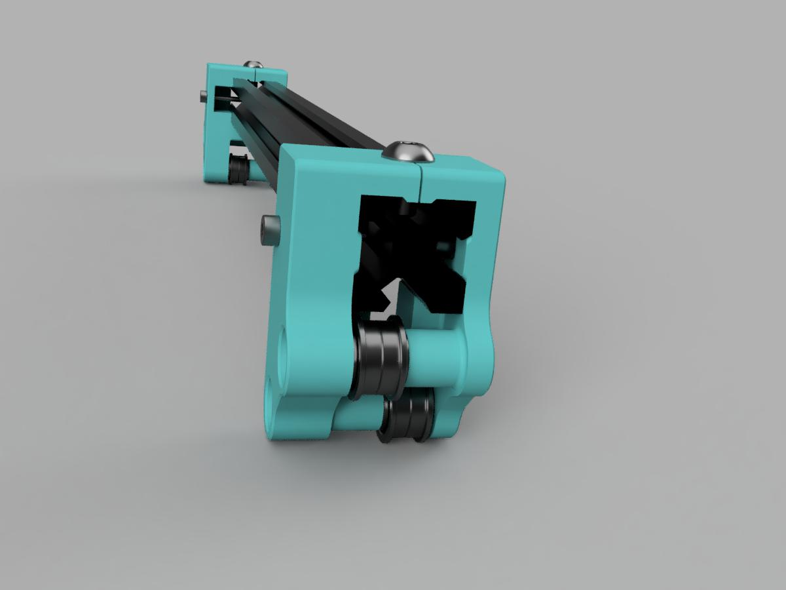
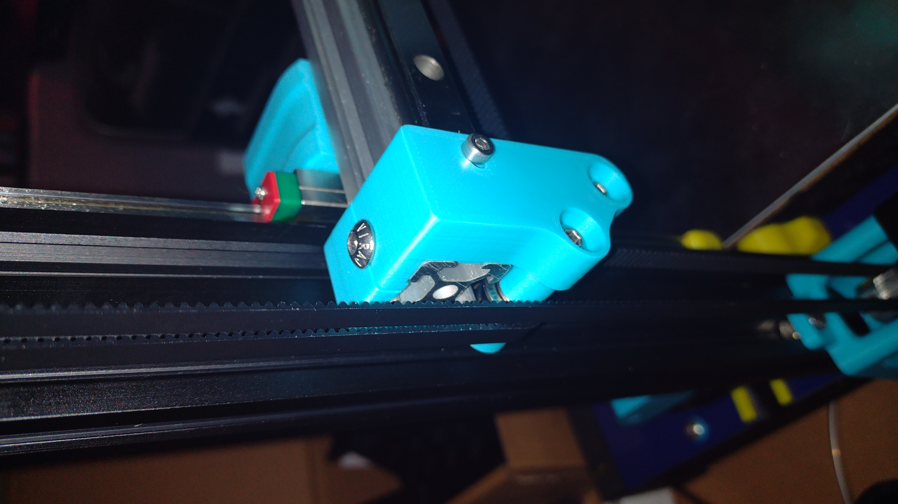

# Improved XZ blocks

Based on [Yenda's robust belt paths](https://github.com/VoronDesign/VoronUsers/tree/master/printer_mods/yenda/vsw_more_robust_belt_paths) and DaRk_dOg rev2

Not sure if these help or let me rule out one particular source of skewed belt path, but assembly is much easier as these always go on square.